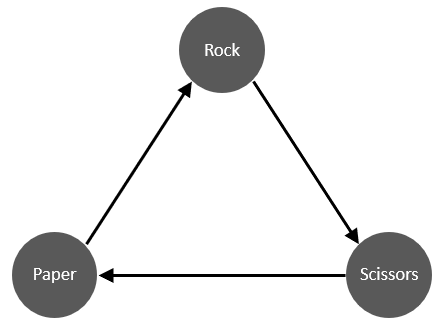

<!-- README.md is generated from README.Rmd. Please edit that file -->

```{r, include = FALSE}
knitr::opts_chunk$set(
  collapse = TRUE,
  comment = "#>",
  fig.path = "man/figures/README-",
  out.width = "100%"
)
```

# mELO 

<!-- badges: start -->
<!-- badges: end -->

An R implementation of DeepMind's [multidimensional Elo rating](https://arxiv.org/abs/1806.02643)
(mELO) approach. The mELO rating system has the desirable properties of being able 
    to handle cyclic, non-transitive interactions and is better behaved in the presence of 
    redundant copies of agents or tasks. 
    
Specifically, [Balduzzi, et al. (2018)](https://arxiv.org/abs/1806.02643) propose that a rating/evaluation method should have the following properties:

* **P1.** *Invariant*: adding redundant copies of an agent or task to the data should make no difference.
* **P2.** *Continuous*: the evaluation method should be robust to small changes in the data.
* **P3.** *Interpretable*: hard to formalize, but the procedure should agree with intuition in basic cases.
    
Typical methods for performing pairwise comparisons such as Elo or Glicko 
violate **P1** and can result in poor evaluations of agents and poor predictions 
of outcomes.
    
This package uses code directly from Alec Stephenson and Jeff Sonas excellent 
[PlayerRatings](https://cran.r-project.org/package=PlayerRatings) package (v1.0-3, 2019-02-22).

## Installation

You can install the `mELO` package from github using

```{r install, eval = FALSE}
devtools::install_github("dclaz/mELO")
```
and it can be loaded using 
```{r load_package}
library(mELO)
```


## Introduction

The following vignettes describe the functionality and utility of the package
in more detail:

* [Introduction](vignettes/introduction.html). 
* [Application to AFL matches](vignettes/afl.html).


## Example

The example below demonstrates how a ratings model can be fit using the `ELO` 
and `mELO` functions.

We will fit models to predict the outcome of **rock-paper-scissor** matches. It 
contains `r nrow(rps_df)` matches. 
<p align="center">
  
</p>


```{r ELO_example}
# Inspect rock paper scissors data
head(rps_df)

# Fit ELO model
rps_ELO <- ELO(rps_df)

# Inspect modelled ratings
rps_ELO

# Get predictions
ELO_preds <- predict(
    rps_ELO,
    head(rps_df)
)

# Inspect outcomes and predictions
cbind(
    head(rps_df),
    ELO_preds = round(ELO_preds, 3)
)
```
We note that while the estimated ratings are roughly equal, the predicted 
probabilities are very poor. Elo cannot handle the cyclic, non-transitive 
nature of this system.

```{r mELO_example}
# Fit mELO model
rps_mELO <- mELO(rps_df, k=1)

# Inspect modelled ratings
rps_mELO

# Get predictions
mELO_preds <- predict(
    rps_mELO,
    head(rps_df)
)

# Inspect outcomes and predictions
cbind(
    head(rps_df),
    mELO_preds = round(mELO_preds, 3)
)
```

The mELO model with `k=1` *can* handle the cyclic, non-transitive 
nature of this system which results in much more accurate predictions. The `k` 
parameter determines the complexity of the non-transitive interactions that will 
be attempted to be modelled.

