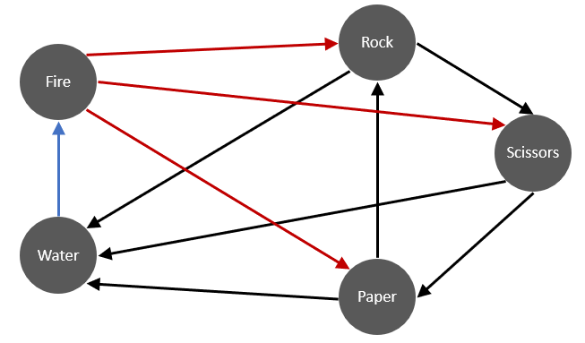

```{r, include = FALSE}
knitr::opts_chunk$set(
  collapse = TRUE,
  comment = "#>"
)
```

# Introduction

For the [AFL data](afl.html), we observed that the mELO model did not outperform the standard Elo model, despite the ability to model more complex interactions between teams. We suspect that the $\textbf{C}$ matrix could not be adequately estimated in the presence of noisy outcomes and thus the adjustments to the base ratings only hurt prediction performance. In this setting, we use noisy to mean that the match outcomes come from a probability distribution and thus two teams could play each other twice in the exact same condition and results of the two matches could be very different. 

An additional challenge for the evaluation of sporting clubs, is that their *true* abilities can change in time, but will be difficult to estimate due to random variations in their, and their oponents performances. An Elo model with a learning rate too small, may not track changes in undyling abilities fast enough, a learning rate too high will result in evaluations that are fit to the noise in recent performances.

In this document, we will attempt understand how well a mELO model can capture the dynamics 
of the [rock-paper-scissors-fire-water](01_introduction.html#rock-paper-scissors-fire-water) game in a controlled environment where the agents never change in underlying ability and we can vary the amount of noise in the outcomes. 


# Method

We will perform a series of simulations to assess the estimation abilities of a mELO model with $k=2$ where the ordinary probability of a win is modified to simulate the effect of noise in the outcome.

The ordinary rock-paper-scissors-fire-water game (hereon referred to as **rpsfw**) has non-transitive interactions that are described by the following figure:

<p align="center">
  
</p>

The direction of the arrows indicate which throw defeats the others with certainty i.e; throw $i$ beats $j$ with $p_{ij}=1$ *iff* there is an edge from $i$ to $j$. In the simulations that follow, an edge from $i$ to $j$ will indicate a win probability of $p^*_{ij}$ and a loss probability of $q^*_{ij}=1-p_{ij}$. Ignoring cases when $i=j$, the new success probabilities $p^*_{ij}$ are defined such that
$$
  p^*_{ij} = 
    \begin{cases}
      p_{ij} - \kappa   & \text{if  } p_{ij} = 1 \\
      p_{ij} + \kappa   & \text{if  } p_{ij} = 0 
    \end{cases}
$$
where $\kappa \in (0,0.5)$. We will denote this modified game as **M-rpsfw**. Also note that $p^*_{ji} = q^*_{ij}$

This adjustment is equivalent to controlling the Bit Error Rate (BER) which is simply the proportion of outcomes that are flipped, which in this case will simply be equal to $\kappa$. Whilst the outcomes of each match $y_{ij}$ in **rpsfw** were deterministically set to either 0 or 1, in **M-rpsfw** they are 
$$
\begin{align}
  y^*_{ij} &\sim \text{Bernoulli}(p^*_{ij}) &\text{ for } i \neq j, \\
  y^*_{ij} &= 0.5 &\text{ for } i = j 
\end{align}
$$  

We can also think of changing the outcome probabilities as influencing the systems Signal to Noise Ratio:
$$
 \text{SNR} = \frac{|0.5-\kappa|}{(\kappa(1-\kappa))^{1/2}} \\
 
$$
where $\kappa=0.5$ corresponds to no signal where it would be impossible to predict an outcome in advance (a coin flip) and $\kappa = 0$ is a noiseless signal (**rpsfw**).


The simulations should be able to give us an understanding of how well a mELO model can capture the dynamics of the **rpsfw** game in the presence of noisy outcomes (**M-rpsfw**). Specifically, we are testing the ability of a mELO model to predict outcomes in a system that has non-transitive probabilistic interactions (as opposed to simple deterministic interactions in  **rpsfw**). 

The loss function $\mathcal{B}_{\kappa, n}$ that will be used to measure the relative accuracy of the models will be calcuated for numerous combinations of error rates $\kappa$ and number of training samples $n$. It is calculated as
$$
  \mathcal{B}_{\kappa, n} = \frac{1}{R}\sum_{r=1}^{R} \big( \frac{1}{|\mathcal{T}|}\sum_{\mathcal{m}_{ij}\in \mathcal{T}}(p^*_{ij} - \hat p_{ij})^2 \big)
$$
where 

* $r$ indexes the simulation replication.
* $R$ is the number of simulation replications.
* $\mathcal{m}_{ij}$ is a match between $i$ and $j$.
* $\mathcal{T}$ is the set of matches in the test data. 
* $|mathcal{T}|=25$ is the number of matches in $\mathcal{T}$ (all possible distinct matches).
* $p^*_{ij}$ is win probability for $i$ over $j$.
* $\hat p_{ij}$ is the mELO estimate of $p^*_{ij}$.

This loss function is essentially a [Brier Score](https://en.wikipedia.org/wiki/Brier_score) average over simulation replications. We use multiple replications due to the randomness in the initialisation of the $\textbf{C}$ matrix for the mELO model.


## The data

Below we give a sample of the data with varying noise/error rates, where draws get randomly assigned to a win or loss with equal probability:

```{r data, message=FALSE, warning=FALSE}
# Initial set up
library(dplyr)
library(ggplot2)
library(mELO)
set.seed(31337)

rpsfw_df %>%
  mutate(
    outcome_k000 = add_noise_to_outcomes(outcome, error_prob = 0.00),
    outcome_k010 = add_noise_to_outcomes(outcome, error_prob = 0.10),
    outcome_k050 = add_noise_to_outcomes(outcome, error_prob = 0.50)
  ) %>%
  filter(throw_1 != throw_2) %>%
  sample_n(10) %>%
  knitr::kable()
```

`outcome` is the original noiseless outcome, `outcome_k<###>` are outcomes drawn from
$\text{Bernoulli}(p^*_{ij})$ where $p^*_{ij}$ is a function of $kappa$ (`error_prob`).
We observe that `outcome_k010` has very few *errors* whilst `outcome_k50` is random.


Before we begin the simulations, we have to do some work to prepare the data:
```{r data_2}
# Increase sample size
rpsfw_df_mod <-  do.call(
    "rbind",
    replicate(20, rpsfw_df, simplify = FALSE)
)
# randomise and re-index  
rpsfw_df_mod <- rpsfw_df_mod %>%
  sample_frac(1, replace=FALSE) %>%
  mutate(time_index = 1:n())

# Generate the samples we will test against, all distinct combinations
test_df <- rpsfw_df_mod %>%
  distinct(
    throw_1,
    throw_2,
    .keep_all = TRUE
  ) %>%
  arrange(throw_1, throw_2) %>%
  mutate(time_index = 1:n())

```

## Simulations


```{r simulations_1}
# Function that calculates the score for a single replication 
optim_inner_brier_score <- function(kappa, n){
  
    current_rpsfw_df_mod <- rpsfw_df_mod %>%
      mutate(
        outcome = add_noise_to_outcomes(outcome, error_prob = kappa),
        outcome = ifelse(throw_1 == throw_2, 0.5, outcome)
      ) %>%
      slice(1:n)
    
    current_test_df <- test_df %>%
      mutate(
        outcome = ifelse(outcome == 1, 1-kappa, outcome),
        outcome = ifelse(outcome == 0, kappa, outcome)
      )
    
  error_calc <- function(hyperparams){

    model <- mELO(
      current_rpsfw_df_mod,
      k = 2,
      eta_1 = hyperparams[1],
      eta_2 = hyperparams[2],
      save_history = FALSE
    )
    
    preds <- predict(
      model,
      current_test_df
    )
    
    error <- mean((current_test_df$outcome - preds)^2)
    error
  
  }
  
  opt_par <- optim(
    c(30, 0.1),
    error_calc,
    method = "BFGS"
  )
  
  results <- list()
  results$par <- opt_par$par
  results$value <- opt_par$value
  return(results)
  
}

    model <- mELO(
      current_rpsfw_df_mod,
      k = 2,
      eta_1 = 29.74933142,
      eta_2 = 0.03691125,
      save_history = FALSE
    )


```


```{r lol}
snr <- function(p){
  abs(0.5-p)/ sqrt(p*(1-p))
}

snr_n <- function(p,n){
  n*abs(0.5-p)/ sqrt(n*p*(1-p))
}

```

# Results


```{r results_plot1}
1
```

# Conclusion


